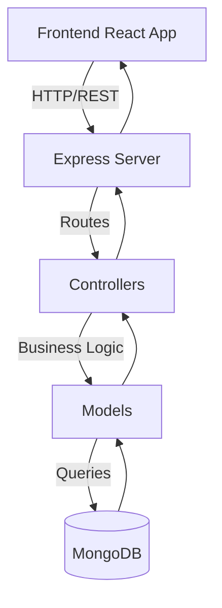

# 🚀 Backend Development Guide (Node.js + Express + TypeScript + MongoDB)

This document explains the **full journey of building this backend** --> from zero setup to production deployment.  

---

**📦 1. Project Initialization**
- Create a new Node.js + TypeScript project:
  ```bash
  mkdir backend && cd backend
  npm init -y
  npm install express mongoose cors dotenv jsonwebtoken bcryptjs
  npm install -D typescript ts-node-dev @types/node @types/express @types/bcryptjs @types/jsonwebtoken
  npx tsc --init
  ```
- Setup `.gitignore`, `README.md`, and environment files (`.env`, `.env.example`).

**⚙️ 2. Project Configuration**
- Add `tsconfig.json` for TypeScript compilation.
- Add `nodemon.json` for auto-reloading with `ts-node-dev`.
- Example `scripts` in `package.json`:
  ```json
  "scripts": {
    "dev": "ts-node-dev --respawn --transpile-only src/server.ts",
    "build": "tsc",
    "start": "node dist/server.js"
  }
  ```
#### 🔥 Endpoints

- `POST /auth/register` 
    - { email, username, name, password }` -> `{ user, token }
- `POST /auth/login` 
    - { username, password }` -> `{ user, token }
- `POST /projects`  (auth) 
    - `{ name }`
- `POST /tasks` (auth) 
    - { id,projectId, title, description?, status?, priority?, due? }
- `GET /projects` (auth)
- `GET /tasks` (auth) query: `q,status,projectId,sort`
- `GET /tasks/:id` (auth)
- `PATCH /tasks/:id` (auth)
- `DELETE /tasks/:id` (auth)

---  

**🏗️ 3. Project Architecture**

Organize the project into layers:

```bash
src/
 ├── config/          # Environment & Database setup
 │   ├── env.ts
 │   └── db.ts
 ├── models/        # Mongoose models
 │   ├── User.ts
 │   ├── Task.ts
 │   └── Project.ts
 ├── controllers/   # Request handlers
 │   ├── auth.controller.ts
 │   ├── task.controller.ts
 │   └── project.controller.ts
 ├── routes/        # API routes
 │   ├── auth.routes.ts
 │   ├── task.routes.ts
 │   └── project.routes.ts
 ├── middleware/    # Custom middlewares
 │   └── auth.ts
 ├── docs/          # OpenAPI & Swagger docs
 │   ├── openapi.ts
 │   └── swagger.ts
 ├── types/         # Custom TypeScript definitions
 ├── app.ts         # Express app setup
 └── server.ts      # Server entrypoint
```

---

## 🔑 4. Authentication & Security
- JWT-based authentication (`jsonwebtoken`).
- Password hashing with **bcryptjs**.
- Middleware `auth.ts` to protect private routes.

---

## 📡 5. API Endpoints
### Auth Routes (`/api/auth`)
- `POST /login` → Authenticate user.
- `POST /register` → Create new user.

### Task Routes (`/api/tasks`)
- `GET /` → Fetch all tasks.
- `POST /` → Create task.
- `PUT /:id` → Update task.
- `DELETE /:id` → Delete task.

### Project Routes (`/api/projects`)
- `GET /` → Fetch all projects.
- `POST /` → Create new project.

---

## 🗄️ 6. Database (MongoDB)
- Connection defined in `config/db.ts`.
- Models defined using **Mongoose**:
  - `User` (email, password, roles)
  - `Task` (title, description, status, project reference)
  - `Project` (name, description, tasks reference)

---

## 📜 7. API Documentation
- **Swagger / OpenAPI** docs located in `src/docs/`.
- Integrated with Express for live API exploration.

---

## 🧪 8. Testing
- Test controllers, routes, and authentication flow.

---

## 🚀 9. Build & Deployment
1. **Build for production**:
   ```bash
   npm run build
   ```
2. **Start production server**:
   ```bash
   npm run dev
   ```
---

## 🔄 10. Data Flow Architecture


---

**✅ Summary**
By following these steps, the backend goes from:
- **Zero setup → REST API with Auth & Database → Production-ready server**  
using **Node.js, Express, TypeScript, MongoDB, JWT, and Swagger documentation**.
