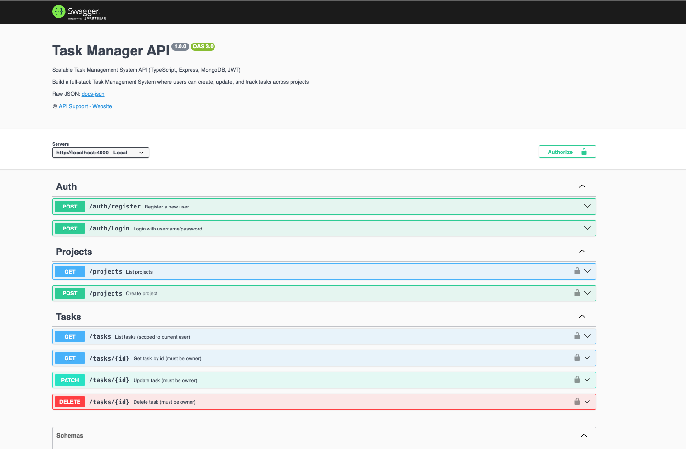

#  Task Management System: [UI]

A  full-stack Task Management System where users can create, update, and track tasks across projects

### 1. **Technologies**
-  TypeScript + Redux Toolkit
-  JWT auth
-  Private routes
-  Tailwind for responsive UI
-  Express API connected to MongoDB

**output:**

- Dashboard

- login

- Api documentation

